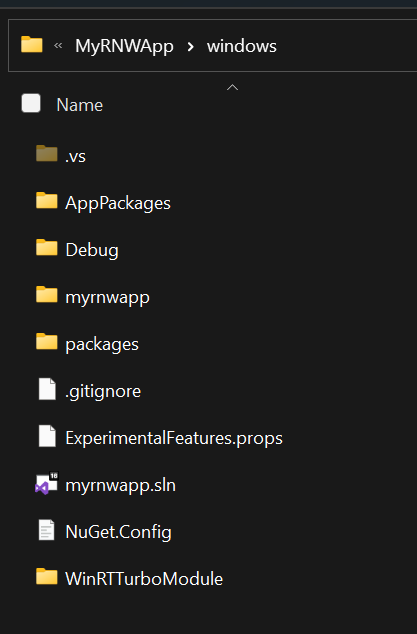
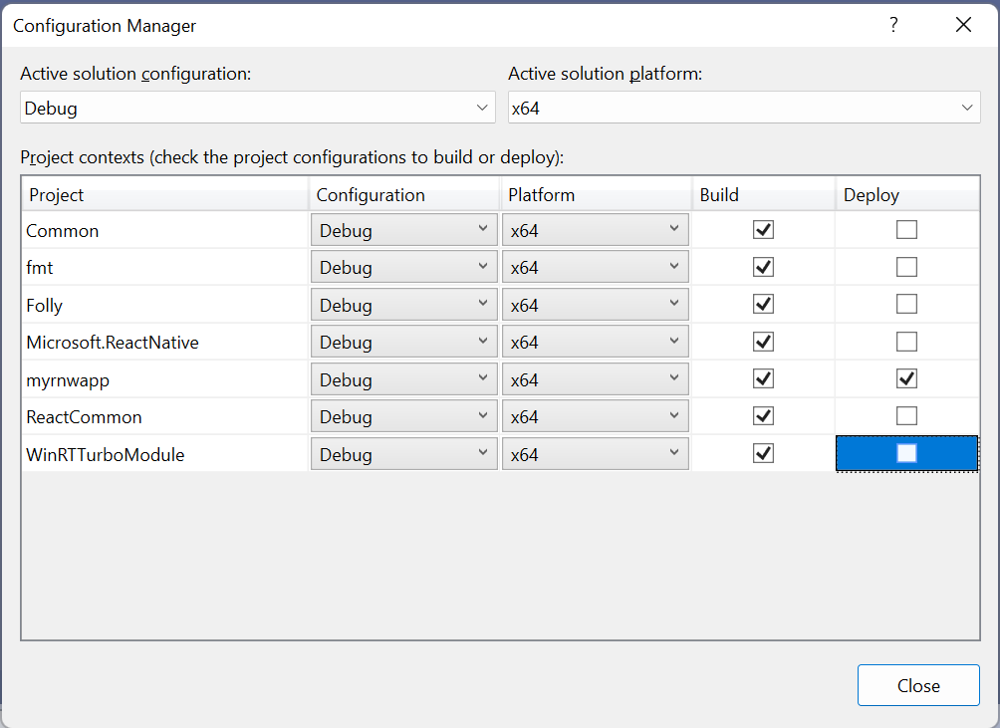

# The JS/WinRT language projection

JavaScript WinRT (JS/WinRT) is a module for React Native Windows which provides access to WinRT APIs from Javascript. It uses components from [xlang](https://github.com/Microsoft/xlang) to [parse metadata](https://github.com/microsoft/winmd) for public or private WinRT COM APIs and generate JSI (JavaScript Interface) wrappers for [C++/WinRT](https://github.com/microsoft/cppwinrt) types at compile-time and the code generator was itself derived from `cppwinrt.exe`.

## Building JS/WinRT Sample

- Open a dev command prompt pointing at the root of the repo.
- Run `npm install` under ["\samples\RNWinRTTestApp\"](./samples/RNWinRTTestApp)
- Open the [`RNWinRTTestApp.sln`](./samples/RNWinRTTestApp/windows/RNWinRTTestApp.sln) solution.
- Build the x64 Release or Debug configuration.
- If running Debug: Run 'yarn start' under ["\samples\RNWinRTTestApp\"](./samples/RNWinRTTestApp)
- F5 deploy the sample app.

## Usage

The following steps demonstrate how to use the Microsoft.Windows.JsWinRT NuGet package to consume WinRT APIs in a React Native Windows (RNW) app.

1. Open your existing RNW app, or follow [these docs](https://microsoft.github.io/react-native-windows/docs/getting-started) to create a new RNW app.

1. Follow these steps to add and configure the `WinRTTurboModule` project to your RNW project. Note that the `WinRTTurboModule` project already includes a reference to the Microsoft.Windows.JsWinRT NuGet package.

    1. Copy the [`WinRTTurboModule`](./samples/RNWinRTTestApp/windows/WinRTTurboModule) source directory from the RnWinRTTestApp sample to the `windows` directory in your React Native Windows app. Your directory structure will look something like this:

        

    1. Add [`WinRTTurboModule.vcxproj`](./samples/RNWinRTTestApp/windows/WinRTTurboModule/WinRTTurboModule.vcxproj) to your solution. In Visual Studio: right click on the solution, and click **Add** -> **Existing Project**. Navigate to `WinRTTurboModule.vcxproj` in the file picker dialog and open the file.

    1. Turn off deploy for the WinRTTurboModule project. In Visual Studio, go to **Build** -> **Configuration Manager**, and uncheck the **Deploy** option for the Build/Configuration being used.

        

    1. Specify the WinRT namespaces that you want to consume in the <JsWinRTParameters> property in `WinRTTurboModule.vcxproj`. In Visual Studio, right click on the `WinRTTurboModule` project and select **Unload Project**. You can then directly edit the `WinRTTurboModule.vcxproj`. Here is an example of how to set the `JsWinRTParameters` property:

        ```xml
        <JsWinRTParameters>-include Windows.Globalization -include Windows.Storage</JsWinRTParameters>
        ```

1. Reload and build the `WinRTTurboModule` project.

1. Follow these steps to include the projected WinRT namespaces and consume them in your RNW app.

    1. Add a project reference from your React Native Windows app to the `WinRTTurboModule` project. In Visual Studio, right click on your React Native Windows app project, select **Add Project Reference** and select **WinRTTurboModule**.

    1. Add the following line to to your project's `pch.h` file.

        ```cpp
        `#include <winrt/WinRTTurboModule.h>`
        ```

    1. Add the following line to your project's `App.cpp` file, underneath the line `PackageProviders().Append(make<ReactPackageProvider>());`:

        ```cpp
        PackageProviders().Append(winrt::WinRTTurboModule::ReactPackageProvider());`
        ```

    1. Add the following line to your project's `index.js` file:

        ```js
        import './WinRTTurboModule';`
        ```

    1. Create a file named `WinRTTurboModule.js` under your root project directory (next to `index.js`), and copy the contents of [jswinrt/js/WinRTTurboModule.js](./jswinrt/js/WinRTTurboModule.js) to it.  This should be something like the following:

        ```js
        import * as TurboModuleRegistry from 'react-native/Libraries/TurboModule/TurboModuleRegistry';
        const module = TurboModuleRegistry.get('WinRTTurboModule');
        if (module) {
            module.initialize();
        }
        export default module;
        ```

    1. You can now call any of the projected WinRT APIs in your RNW app (in Javascript or Typescript). See [App.tsx](samples/RNWinRTTestApp/App.tsx) in the sample for an example.  

1. Build and deploy/run your RNW app. If running Debug, first run `yarn start` from the root directory of your app before running the app.

## Contributing

This project welcomes contributions and suggestions of all types. See our [Contributor's Guide](/CONTRIBUTING.md) for more information.

## Trademarks

This project may contain trademarks or logos for projects, products, or services. Authorized use of Microsoft trademarks or logos is subject to and must follow [Microsoft's Trademark & Brand Guidelines](https://www.microsoft.com/en-us/legal/intellectualproperty/trademarks). Use of Microsoft trademarks or logos in modified versions of this project must not cause confusion or imply Microsoft sponsorship. Any use of third-party trademarks or logos are subject to those third-party's policies.
