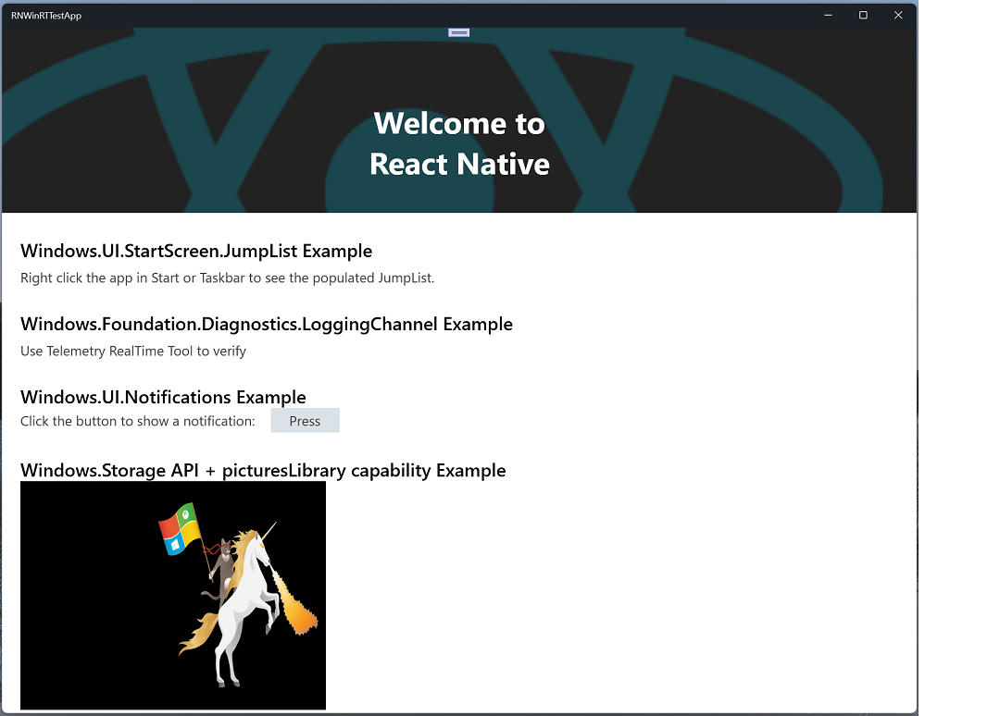

# React Native WinRT

React Native WinRT is a module for [React Native for Windows](https://microsoft.github.io/react-native-windows/) developers who want to call native (non-XAML) WinRT APIs in their apps. It uses components from [xlang](https://github.com/Microsoft/xlang) to [parse metadata](https://github.com/microsoft/winmd) for public or private WinRT COM APIs and generate JSI (JavaScript Interface) wrappers for [C++/WinRT](https://github.com/microsoft/cppwinrt) types at compile-time. The code generator was itself derived from `cppwinrt.exe`.

This repo generates the [Microsoft.ReactNative.WinRT NuGet packages](https://www.nuget.org/packages/Microsoft.ReactNative.WinRT) for specific versions of React Native Windows. 

## Getting started

Refer to the [usage docs](docs/USAGE.md) for instructions on how to use React Native WinRT in your React Native Windows app to call projected WinRT APIs in Javascript.

### Sample code

See the [sample app](/samples/RNWinRTTestApp/) for an example of using React Native WinRT to consume WinRT APIs.

## Versioning

The versioning scheme for React Native WinRT aligns with versions of React Native for Windows. A new major version of React Native for Windows is not guaranteed to be supported by a mismatched version of React Native WinRT. For example, a React Native for Windows 0.67 app may not be compatible with **Microsoft.ReactNative.WinRT** 0.66.* package versions due to potential breaking changes.

React Native WinRT currently supports the following versions of React Native for Windows: 

- [release/0.66](https://github.com/microsoft/react-native-winrt/tree/release/0.66)
- [release/0.65](https://github.com/microsoft/react-native-winrt/tree/release/0.65)
- [release/0.64](https://github.com/microsoft/react-native-winrt/tree/release/0.64)

## Contributing

_We want to hear from you!_ File a [new issue](https://github.com/microsoft/react-native-winrt/issues/new) to report a bug, ask a question, or make a suggestion. See our [Contributor's Guide](/CONTRIBUTING.md) for more information.

## Trademarks

This project may contain trademarks or logos for projects, products, or services. Authorized use of Microsoft trademarks or logos is subject to and must follow [Microsoft's Trademark & Brand Guidelines](https://www.microsoft.com/en-us/legal/intellectualproperty/trademarks). Use of Microsoft trademarks or logos in modified versions of this project must not cause confusion or imply Microsoft sponsorship. Any use of third-party trademarks or logos are subject to those third-party's policies.
