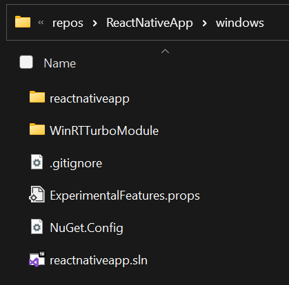
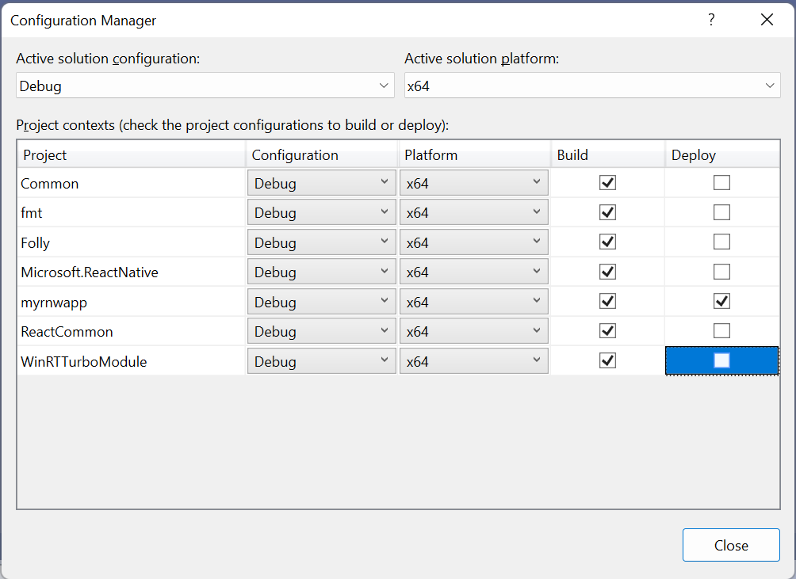

## Usage 

The following steps demonstrate how to use the Microsoft.ReactNative.WinRT NuGet package to consume WinRT APIs in a React Native Windows (RNW) app.

1. Open your existing RNW app, or follow [these docs](https://microsoft.github.io/react-native-windows/docs/getting-started) to create a new RNW app.

1. Follow these steps to add and configure the `WinRTTurboModule` project to your RNW project. Note that the `WinRTTurboModule` project already includes a reference to the Microsoft.ReactNative.WinRT NuGet package.

    1. Copy the [`WinRTTurboModule`](../samples/RNWinRTTestApp/windows/WinRTTurboModule) source directory from the RnWinRTTestApp sample to the `windows` directory in your React Native Windows app. Your directory structure will look something like this:

        

    1. Add [`WinRTTurboModule.vcxproj`](../samples/RNWinRTTestApp/windows/WinRTTurboModule/WinRTTurboModule.vcxproj) to your solution. In Visual Studio: right click on the solution, and click **Add** -> **Existing Project**. Navigate to `WinRTTurboModule.vcxproj` in the file picker dialog and open the file.

    1. Turn off deploy for the WinRTTurboModule project. In Visual Studio, go to **Build** -> **Configuration Manager**, and uncheck the **Deploy** option for the Build/Configuration being used.

        

    1. Specify the WinRT namespaces that you want to consume in the <RnWinRTParameters> property in `WinRTTurboModule.vcxproj`. In Visual Studio, right click on the `WinRTTurboModule` project and select **Unload Project**. You can then directly edit the `WinRTTurboModule.vcxproj`. Here is an example of how to set the `RnWinRTParameters` property:

        ```xml
        <RnWinRTParameters>-include Windows.Globalization -include Windows.Storage</RnWinRTParameters>
        ```

1. Reload and build the `WinRTTurboModule` project.

1. Follow these steps to include the projected WinRT namespaces and consume them in your RNW app.

    1. Add a project reference from your React Native Windows app to the `WinRTTurboModule` project. In Visual Studio, right click on your React Native Windows app project, select **Add Project Reference** and select **WinRTTurboModule**.

    1. Add the following line to to your project's `pch.h` file.

        ```cpp
        #include <winrt/WinRTTurboModule.h>
        ```

    1. Add the following line to your project's `App.cpp` file, underneath the line `PackageProviders().Append(make<ReactPackageProvider>());`:

        ```cpp
        PackageProviders().Append(winrt::WinRTTurboModule::ReactPackageProvider());
        ```

    1. Add the following line to your project's `index.js` file:

        ```js
        import './WinRTTurboModule';
        ```

    1. Create a file named `WinRTTurboModule.js` under your root project directory (next to `index.js`), and copy the contents of [rnwinrt/js/WinRTTurboModule.js](../rnwinrt/js/WinRTTurboModule.js) to it.  This should be something like the following:

        ```js
        import * as TurboModuleRegistry from 'react-native/Libraries/TurboModule/TurboModuleRegistry';
        const module = TurboModuleRegistry.get('WinRTTurboModule');
        if (module) {
            module.initialize();
        }
        export default module;
        ```

    1. You can now call any of the projected WinRT APIs in your RNW app (in Javascript or Typescript). See [App.tsx](../samples/RNWinRTTestApp/App.tsx) in the sample for an example.  

1. Build and deploy/run your RNW app. If running Debug, first run `yarn start` in the command prompt from the root directory of your app.

### Troubleshooting

- If running Debug, make sure to run `yarn start` in the command prompt before running the app. Otherwise, you may see an error with "connection with server could not be established".

- When running Debug, you may see the error: "ReferenceError: Windows is not defined". The browser debugger is not supported with React Native Windows, so you may need to change this line in `App.cpp`:

    ```cpp
    `InstanceSettings().UseWebDebugger(true);`
    ```
    to this:
    ```cpp
    `InstanceSettings().UseWebDebugger(false);`
    ```
