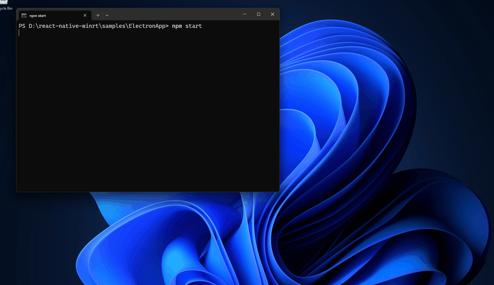

# Electron Sample App

This sample shows how an Electron app can call WinAppSDK APIs using rnwinrt in "node mode" (using the new -node flag).

In this screen capture, we call the WinAppSDK AppWindow API to show a new window from Electron Javascript code:




# How to build electron sample

## Prerequisites
* Node (`winget install --id OpenJS.NodeJS.23`)
* python
* node-gyp (?)
* Visual Studio

## Steps

This is all using "pwsh":

```pwsh
# Build rnwinrt.exe and run node tests:
cd <reporoot>
.\build_and_test.ps1

cd samples\ElectronApp

# Install dependencies, and run rnwinrt to generate the C++ WinRT wrappers
npm i

# Build the C++ code
npm run build

# Run the app!
npm start
```

# Open Issues / TODOS
- Build warnings with VS 2026