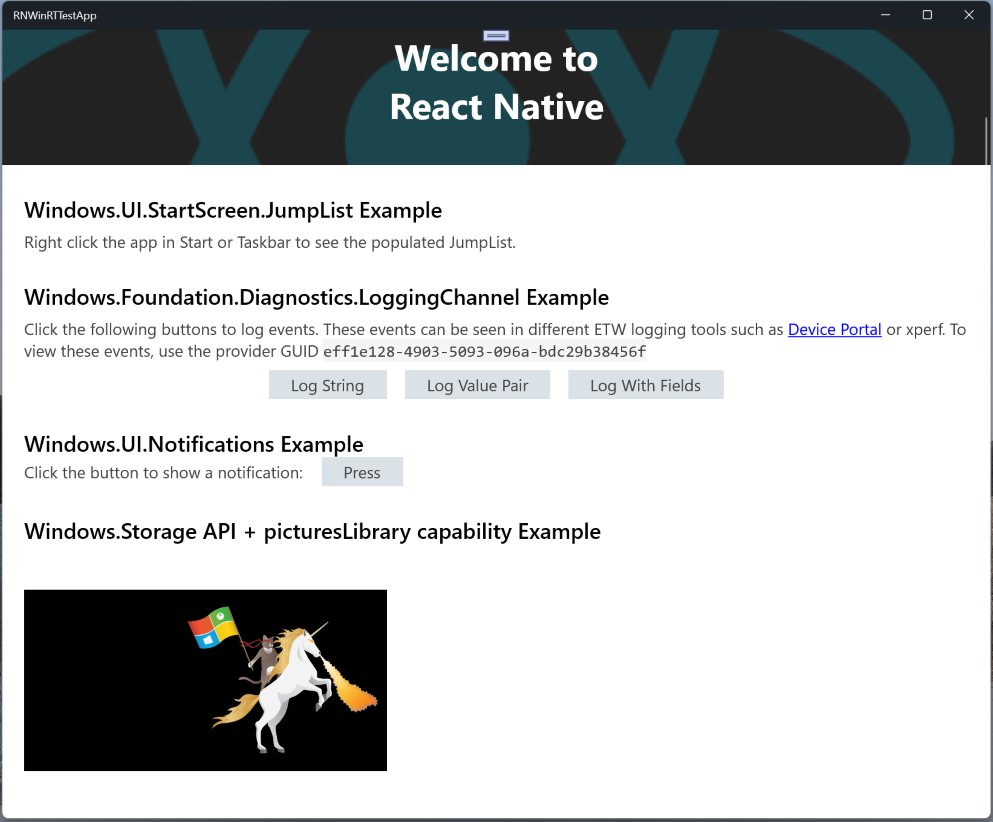

# React Native WinRT Sample

This sample demonstrates how to use the **react-native-winrt** package to consume projected WinRT APIs with Javascript in a React Native for Windows app.

The WinRT APIs demonstrated in this sample include:
- `Windows.UI.StartScreen`
- `Windows.Foundation.Uri`
- `Windows.Storage`
- `Windows.Foundation.Diagnostics`
- `Windows.UI.Notifications`

## Prerequisites

- See [System Requirements](https://microsoft.github.io/react-native-windows/docs/rnw-dependencies) for React Native for Windows development

## Building and running the sample

1. Open an 'x64 Native Tools Command Prompt for VS 2022' (or whichever version of Visual Studio you have installed)
1. Clone or download the react-native-winrt repository.
    ```cmd
    C:\> git clone https://github.com/microsoft/react-native-winrt.git
    C:\> cd react-native-winrt
    ```
1. "Build" the local package by executing the script:
    ```cmd
    C:\react-native-winrt> scripts\build-npm-package.cmd
    ```
1. Change the working directory to this directory
    ```cmd
    C:\react-native-winrt> cd samples\RNWinRTTestApp
    ```
1. Run `yarn install`
    ```cmd
    C:\react-native-winrt\samples\RNWinRTTestApp> yarn install
    ```
    > *NOTE: Because this project references local file contents for the `react-native-winrt` package, you must run `yarn install` as opposed to `npm install`, otherwise you may get build errors*
1. If using the **command line**: 
    ```cmd
    C:\react-native-winrt\samples\RNWinRTTestApp> npx react-native run-windows
    ```
    
    If using **Visual Studio**:
    - Open the solution file [`\windows\RNWinRTTestApp.sln`](./windows/RNWinRTTestApp.sln) in Visual Studio.
    - Build the solution.
    - If running Debug: run `yarn start` in the command prompt from this directory.
    - F5 deploy the sample app (*RNWinRTTestApp*).

You will see something similar to below after successfully building and running the sample:


